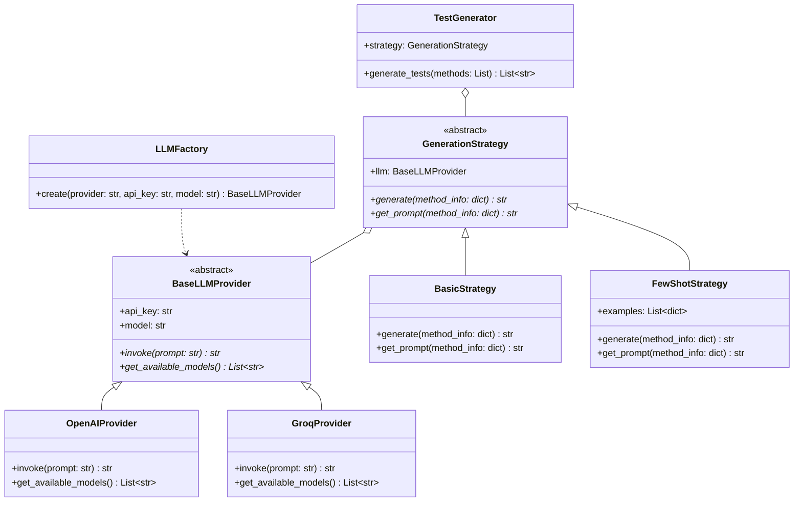

# Generation Module

Bu modül, **Preprocess** aşamasından gelen metot bilgilerini kullanarak **LLM** ile Python birim testleri üretir.

## Kullanılacak Kütüphaneler

| Kütüphane | Açıklama | Kurulum |
|-----------|----------|---------|
| `openai` | OpenAI API client | `pip install openai` |
| `groq` | Groq API client | `pip install groq` |
| `langchain` | LLM orchestration | `pip install langchain` |
| `langchain-openai` | LangChain OpenAI | `pip install langchain-openai` |
| `langchain-groq` | LangChain Groq | `pip install langchain-groq` |
| `pydantic` | Data validation | `pip install pydantic` |
| `jinja2` | Prompt templates | `pip install jinja2` |

---

## Sınıf Diyagramı



---

## Oluşturulacak Dosyalar

```
src/generation/
├── __init__.py
├── providers/
│   ├── __init__.py
│   ├── base.py           # BaseLLMProvider
│   ├── openai_provider.py
│   └── groq_provider.py
├── strategies/
│   ├── __init__.py
│   ├── base.py           # GenerationStrategy
│   ├── basic.py
│   └── fewshot.py
├── factory.py            # LLMFactory
├── generator.py          # TestGenerator
├── prompts/
│   └── templates.py      # Jinja2 prompt templates
└── generation_readme.md
```

---

## Docker Entegrasyonu

```dockerfile
FROM python:3.11-slim

WORKDIR /app
COPY requirements.txt .
RUN pip install -r requirements.txt

COPY src/generation/ ./generation/

ENV OPENAI_API_KEY=""
ENV GROQ_API_KEY=""

CMD ["python", "-m", "generation.generator"]
```

```yaml
# docker-compose.yml
services:
  generation:
    build:
      context: .
      dockerfile: Dockerfile.generation
    environment:
      - OPENAI_API_KEY=${OPENAI_API_KEY}
      - GROQ_API_KEY=${GROQ_API_KEY}
    volumes:
      - ./output/selected_methods:/app/input
      - ./output/generated_tests:/app/output
    depends_on:
      - preprocess
```
