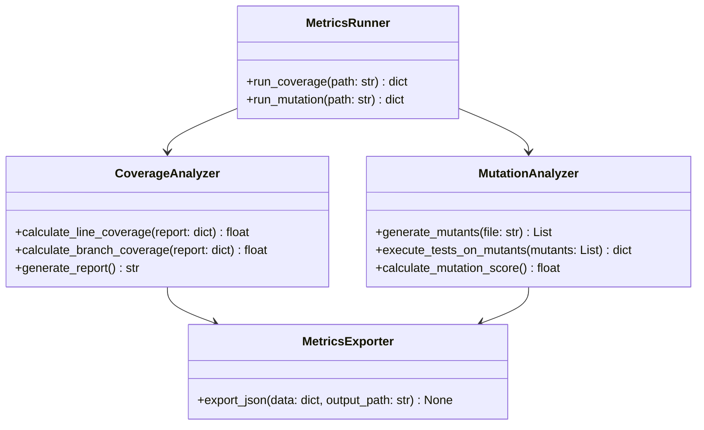

# Metrics Module

Bu modül, yazılım testlerinin kalitesini değerlendirmek, sistemin çeşitli kod kapsamlarını (coverage) hesaplamak ve hata bulma yeteneğini (mutasyon testi üzerinden) analiz etmek için kullanılır.

## Kullanılacak Kütüphaneler

| Kütüphane | Açıklama | Kurulum |
|-----------|----------|---------|
| `pytest` | Testleri çalıştırma motoru | `pip install pytest` |
| `pytest-cov` | Kapsam raporları üretmek için | `pip install pytest-cov` |
| `coverage` | Detaylı kod kapsamı hesaplamaları (built-in eklentisi mevcuttur) | `pip install coverage` |
| `mutmut` | Mutasyon (Mutation) testleri için araç | `pip install mutmut` |
| `json` | Çıktı analiz raporlarını kaydetmek için (built-in) | - |

---

## Test Kapsamları (Coverages)

Aşağıda ölçülecek temel kapsam türleri, ne işe yaradıkları ve metrik modülü tarafından nasıl adım adım ölçüldükleri detaylandırılmıştır.

### 1. Satır Kapsamı (Line Coverage)
- **Ne İşe Yarar:** Projedeki kaynak kod satırlarının yüzde kaçının testlerin çalışması sırasında gerçekten üzerinden geçildiğini (çalıştırıldığını) gösterir. En temel test metriklerinden biridir.
- **Nasıl Ölçülür:**
  1. Test yürütücü (örn. `pytest`), kod kapsamı izleyicisi (`coverage.py`) ile başlatılır.
  2. İzleyici, her bir Python dosyasında çalıştırılabilir (executable) satırları tespit eder.
  3. Testler icra edildikçe, üzerinden geçilen her satır işaretlenir.
  4. Testlerin bitiminde: `(Çalıştırılan Satır Sayısı / Toplam Çalıştırılabilir Satır Sayısı) * 100` formülüyle Satır Kapsamı yüzdesi elde edilir.

### 2. Dal Kapsamı (Branch Coverage)
- **Ne İşe Yarar:** `if`, `else`, `elif`, `for`, `while` gibi karar (şart) mekanizmalarındaki **tüm olası yolların** (örneğin bir `if` bloğunun hem True hem False durumunun) test edilip edilmediğini kontrol eder. Kodda mantıksal hataların gözden kaçmasını minimuma indirir.
- **Nasıl Ölçülür:**
  1. Test konfigürasyonunda branch (dal) izleme aktif hale getirilir (`pytest --cov-branch --cov=.`).
  2. Kapsam aracı araç koddaki karar noktalarını ve bu kararlardan çıkan alternatif dalları (path) tespit eder.
  3. Testler çalışırken izleyici, sadece if bloğuna girilip girilmediğine değil, else veya atlama durumunun da denenip denenmediğine bakar.
  4. Atlanan kararlar raporlanır ve `(Gidilen Dal Sayısı / Toplam Dal Sayısı)` oranıyla hesaplanır.

### 3. Mutasyon Testi (Mutation Testing)
- **Ne İşe Yarar:** **Testlerin test edilmesidir.** Test süitinin (yazdığımız testlerin) kalitesini ölçer. Koddaki küçük parçaları kasıtlı olarak bozar (örneğin `+` işaretini `-` yapar) ve testlerin bu bozulmayı ("mutant"ı) yakalayıp fail verip vermeyeceğine (öldürüp öldüremeyeceğine) bakar.
- **Nasıl Ölçülür:**
  1. Kod üzerinden AST (Abstract Syntax Tree) aracılığıyla varyasyonlar (mutantlar) üretilir (`if a > b` -> `if a >= b` vb.).
  2. Üretilen her bir mutant için test süiti tekrar çalıştırılır.
  3. Eğer testler mutant projede "başarısız" (fail) olursa, mutant "öldürülmüş" (killed) olur (yani testlerimiz iyidir, değişikliği yakalamıştır).
  4. Eğer testler mutant projede hala başarıyla "geçer" (pass) ise, mutant "hayatta kalmış" (survived) olur (yani o bölgedeki test zayıftır).
  5. Kalite skoru `(Öldürülen Mutant / Toplam Mutant)` oranına göre hesaplanır.

### 4. Fonksiyon/Metot Kapsamı (Function/Method Coverage)
- **Ne İşe Yarar:** Kod içerisindeki tanımlanmış tüm metotlardan ve fonksiyonlardan en az bir kez çağrılmış/çalıştırılmış olanların oranını ifade eder.
- **Nasıl Ölçülür:**
  1. Sınıf veya modül düzeyindeki tüm `def` tanımlamaları sayılır.
  2. Test execution esnasında ilgili scope'a girildiği an işaretleme yapılır.
  3. Bir fonksiyonun sadece 1 satırı dahi çalışmış olsa, fonksiyon kapsandı (covered) kabul edilir. Raporlara oran yansıtılır.

### 5. Koşul/Karar Kapsamı (Condition Coverage)
- **Ne İşe Yarar:** Sadece `if` bloğuna girip girmemek değil; `if (A > B ve C == D)` gibi çoklu şart içeren yerlerdeki her bir alt koşulun (hem A > B, hem C == D kısmının) ayrı ayrı kendi True/False durumlarını değerlendirip test edildiğini ölçer.
- **Nasıl Ölçülür:**
  1. Boole mantığı içeren noktalar (and, or kısımları) mantıksal ağaçlara dönüştürülür.
  2. Test sürecinde, bağlaçların içindeki her bir elementin truthy ve falsy olarak değerlendirilediği durumlar tek tek kaydedilir.
  3. Kapsanmayan boolean ihtimaller eksik kapsam (missed conditions) olarak rapora girer.

---

## Sınıf Diyagramı



---

## Oluşturulacak Dosyalar

```
src/metrics/
├── __init__.py
├── runner.py           # Metrik işlemlerini organize eden sınıf
├── coverage.py         # Kapsam (Satır, Dal vb.) analiz işlemlerini yapan sistem
├── mutation.py         # Mutasyon testleri sistemini çalıştıran ve skorlayan modül
├── exporter.py         # Rapor ve sonuçları dışa aktaran sınıf
└── metrics_readme.md
```

---

## Çıktı Formatı

Çıktı dosyası `output/metrics_reports/` klasörüne JSON formatında kaydedilir:

```json
{
  "project": { "name": "project_name" },
  "coverage_metrics": {
    "line_coverage_percent": 87.5,
    "branch_coverage_percent": 82.0,
    "function_coverage_percent": 95.0,
    "uncovered_lines": [45, 46, 78, 92]
  },
  "mutation_metrics": {
    "total_mutants": 120,
    "killed_mutants": 98,
    "survived_mutants": 22,
    "mutation_score_percent": 81.6
  },
  "overall_quality_status": "GOOD"
}
```

---

## Docker Entegrasyonu

```dockerfile
FROM python:3.11-slim

WORKDIR /app
COPY requirements.txt .
RUN pip install -r requirements.txt
RUN pip install pytest pytest-cov mutmut

COPY src/metrics/ ./metrics/
COPY tests/ ./tests/
COPY benchmark/ ./benchmark/

CMD ["python", "-m", "metrics.runner"]
```

```yaml
# docker-compose.yml
services:
  metrics:
    build:
      context: .
      dockerfile: Dockerfile.metrics
    volumes:
      - ./benchmark:/app/benchmark
      - ./tests:/app/tests
      - ./output:/app/output
```
