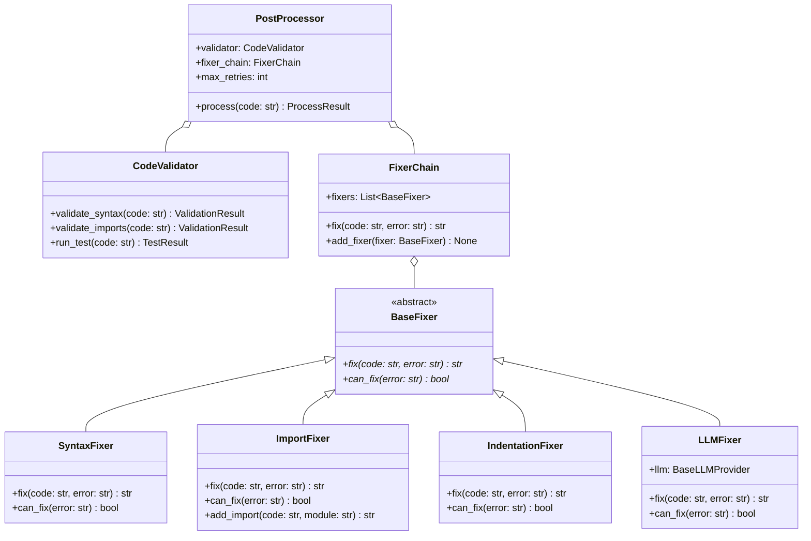
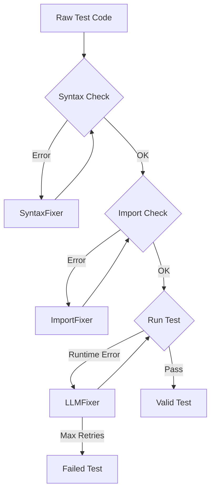

# Postprocess Module

Bu modül, **Generation** aşamasından gelen ham test kodlarını **doğrular**, **düzeltir** ve çalışır hale getirir.

## Kullanılacak Kütüphaneler

| Kütüphane | Açıklama | Kurulum |
|-----------|----------|---------|
| `ast` | Syntax kontrolü (built-in) | - |
| `autopep8` | Kod formatlama | `pip install autopep8` |
| `black` | Kod formatlama | `pip install black` |
| `isort` | Import sıralama | `pip install isort` |
| `pytest` | Test çalıştırma | `pip install pytest` |
| `coverage` | Test coverage | `pip install coverage` |
| `subprocess` | Process yönetimi (built-in) | - |

---

## Sınıf Diyagramı



---

## Oluşturulacak Dosyalar

```
src/postprocess/
├── __init__.py
├── fixers/
│   ├── __init__.py
│   ├── base.py           # BaseFixer
│   ├── syntax.py         # SyntaxFixer
│   ├── imports.py        # ImportFixer
│   ├── indentation.py    # IndentationFixer
│   └── llm_fixer.py      # LLMFixer
├── validator.py          # CodeValidator
├── chain.py              # FixerChain
├── processor.py          # PostProcessor
└── postprocess_readme.md
```

---

## Hata Düzeltme Akışı



---

## Docker Entegrasyonu

```dockerfile
FROM python:3.11-slim

WORKDIR /app
COPY requirements.txt .
RUN pip install -r requirements.txt

COPY src/postprocess/ ./postprocess/
COPY benchmark/ ./benchmark/  # Test için gerekli

CMD ["python", "-m", "postprocess.processor"]
```

```yaml
# docker-compose.yml
services:
  postprocess:
    build:
      context: .
      dockerfile: Dockerfile.postprocess
    volumes:
      - ./output/generated_tests:/app/input
      - ./output/validated_tests:/app/output
      - ./benchmark:/app/benchmark
    depends_on:
      - generation
```

---

## Tam Pipeline (Docker Compose)

```yaml
version: '3.8'

services:
  preprocess:
    build:
      dockerfile: Dockerfile.preprocess
    volumes:
      - ./benchmark:/app/benchmark
      - ./output:/app/output

  generation:
    build:
      dockerfile: Dockerfile.generation
    environment:
      - OPENAI_API_KEY=${OPENAI_API_KEY}
      - GROQ_API_KEY=${GROQ_API_KEY}
    volumes:
      - ./output:/app/output
    depends_on:
      - preprocess

  postprocess:
    build:
      dockerfile: Dockerfile.postprocess
    volumes:
      - ./output:/app/output
      - ./benchmark:/app/benchmark
    depends_on:
      - generation
```

**Çalıştırma:**
```bash
docker-compose up --build
```
