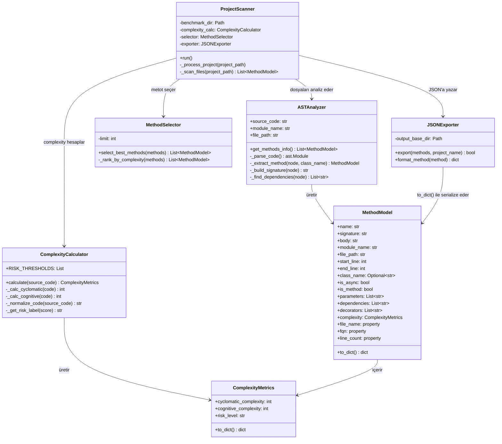

# 📋 Preprocess Modülü

Benchmark projelerini **AST (Abstract Syntax Tree)** ile statik analize tabi tutar, her projeden karmaşıklığa göre **en kritik 50 metodu** seçer ve JSON formatında çıktı üretir.

---

## 🏗️ Mimari

```
benchmark/*.py → Scanner → Analyzer → ComplexityCalculator → Selector → Exporter → JSON
```



---

## 📁 Dosya Yapısı

```
src/preprocess/
├── __init__.py          # Paket tanımı ve dışa aktarımlar
├── __main__.py          # Çalıştırma giriş noktası (python -m src.preprocess)
├── models.py            # MethodModel & ComplexityMetrics dataclass'ları
├── analyzer.py          # AST tabanlı kod analiz mmodülü
├── complexity.py        # Cyclomatic & cognitive complexity hesaplama modülü
├── selector.py          # Karmaşıklığa göre metot seçen modül
├── exporter.py          # JSON dışa aktaran modül
├── scanner.py           # # Tüm analiz sürecini uçtan uca yöneten iş akış(pipeline) modülü
└── output/
    └── selected_methods/
        └── <proje_adı>_methods.json
```

---

## 📦 Bağımlılıklar


| Kütüphane            | Açıklama              | Tür                                |
| -------------------- | --------------------- | ---------------------------------- |
| ast                  | Python AST parser     | Built-in                           |
| pathlib              | Dosya yolu işlemleri  | Built-in                           |
| json                 | JSON okuma/yazma      | Built-in                           |
| dataclasses          | Veri modelleri        | Built-in                           |
| radon                | Cyclomatic complexity | `pip install radon`                |
| cognitive-complexity | Cognitive complexity  | `pip install cognitive-complexity` |

pip install radon cognitive-complexity


🚀 Kullanım

Basit Kullanım:

python -m src.preprocess

Python'dan:

from src.preprocess import ProjectScanner

scanner = ProjectScanner()
scanner.run()

## Özel Benchmark Dizini
scanner = ProjectScanner(benchmark_dir="path/to/projects")
scanner.run()


⚙️ Pipeline Akışı

1. Scanner          benchmark/ altındaki proje dizinlerini bulur
       ↓
2. Scanner          Her projedeki .py dosyalarını recursive tarar
       ↓
3. ASTAnalyzer      Kaynak kodu parse eder, metotları MethodModel'e çevirir
       ↓
4. Complexity       Her metot için CC + cognitive complexity hesaplar
       ↓
5. Selector         Toplam skora göre sıralar, en kritik 50 metodu seçer
       ↓
6. Exporter         Seçilen metotları JSON dosyasına yazar


📄 Modül Detayları
models.py — Veri Modelleri

ComplexityMetrics — Karmaşıklık metrikleri:

| Alan                  | Tip | Açıklama                              |
| --------------------- | --- | ------------------------------------- |
| cyclomatic_complexity | int | Dallanma karmaşıklığı (varsayılan: 1) |
| cognitive_complexity  | int | Okunabilirlik skoru (varsayılan: 0)   |
| risk_level            | str | LOW / MODERATE / HIGH / VERY_HIGH     |


MethodModel — Metot kimlik kartı:

| Alan        | Tip            | Açıklama                                  |
|-------------|----------------|-------------------------------------------|
| name        | str            | Metot adı                                 |
| signature   | str            | Tam imza (def foo(x: int) -> bool)        |
| body        | str            | Kaynak kod                                |
| module_name | str            | Modül adı                                 |
| file_path   | str            | Dosya yolu                                |
| start_line  | int            | Başlangıç satırı                          |
| end_line    | int            | Bitiş satırı                              |
| class_name  | Optional[str]  | Sınıf adı (varsa)                         |
| is_async    | bool           | async def mi?                             |
| is_method   | bool           | Sınıf metodu mu?                          |
| parameters  | List[str]      | Parametre listesi                         |
| dependencies| List[str]      | Çağrılan fonksiyonlar (mocking için)      |
| decorators  | List[str]      | Dekoratörler                              |
| complexity  | ComplexityMetrics | Karmaşıklık metrikleri                |


Property'ler:

| Property   | Açıklama |
|------------|----------|
| file_name  | Dosya yolundan dosya adı (Path(file_path).name) |
| fqn        | Fully Qualified Name (module.ClassName) |
| line_count | Satır sayısı (end_line - start_line + 1) |


analyzer.py — AST Analiz Motoru

Python kaynak kodunu ast modülü ile parse eder. Hem top-level fonksiyonları hem sınıf metotlarını tespit eder.

| Metot | Görevi |
|------|--------|
| get_methods_info() | Tüm metotları bulur, `List[MethodModel]` döner |
| _parse_code() | Kaynak kodu AST ağacına çevirir |
| _extract_method() | Tek bir düğümden `MethodModel` oluşturur |
| _build_signature() | Tip ipuçlarıyla metot imzası oluşturur |
| _extract_decorators() | Dekoratörleri güvenli şekilde string'e çevirir |
| _safe_unparse() | AST node'u güvenli şekilde string'e çevirir |
| _find_dependencies() | Metot içindeki fonksiyon çağrılarını bulur |


complexity.py — Karmaşıklık Hesaplama

| Metot                | Görevi                                |
|----------------------|---------------------------------------|
| calculate()          | Kaynak kod için ComplexityMetrics döner |
| _calc_cyclomatic()   | radon ile CC hesaplar                |
| _calc_cognitive()    | cognitive_complexity ile hesaplar    |
| _get_risk_label()    | Toplam skora göre risk seviyesi belirler |


Risk Eşikleri (Microsoft Standartları):

| Toplam Skor  | Risk Seviyesi |
|--------------|---------------|
| ≤ 10         | LOW |
| ≤ 20         | MODERATE | 
| ≤ 50         | HIGH |
| 50           | VERY_HIGH |            


selector.py — Metot Seçici

Metotları cyclomatic + cognitive toplam skoruna göre sıralar, en kritik 50 metodu seçer.

| Sıralama Kriteri            | Yön            |
|-----------------------------|----------------|
| Birincil: Toplam complexity | Büyükten küçüğe|
| İkincil: Satır sayısı  | Büyükten küçüğe |

exporter.py — JSON Dışa Aktarıcı

Seçilen metotları src/preprocess/output/selected_methods/ dizinine kaydeder.

Dosya adı: <proje_adı>_methods.json
Encoding: UTF-8
Format: 2 boşluk girintili

scanner.py — Pipeline Orkestratörü

Tüm modülleri birleştiren ana sınıf. benchmark/ dizinini tarar ve her proje için pipeline'ı çalıştırır.

| Metot               | Görevi|
|---------------------|----------------|
| run()               | Tüm projeleri tarar|
| _process_project()  |Tek projeyi analiz → seç → dışa aktar | 
| _scan_files()       | TProjedeki .py dosyalarından metotları çıkarır|


📤 Çıktı Formatı

{
  "project": {
    "name": "project_name"
  },
  "file": {
    "name": "auth.py",
    "path": "/absolute/path/to/auth.py"
  },
  "class": {
    "name": "UserAuth",
    "fqn": "auth.UserAuth"
  },
  "method": {
    "name": "login",
    "signature": "async def login(self, username: str, password: str) -> bool",
    "body": "async def login(self, ...):\n    ...",
    "start_line": 45,
    "end_line": 58,
    "line_count": 14,
    "is_async": true,
    "is_method": true,
    "return_type": "bool",
    "parameters": ["self", "username", "password"],
    "dependencies": ["check_password", "db_connect"],
    "decorators": ["@validate_input"],
    "docstring": "Kullanıcı girişini kontrol eder."
  },
  "complexity": {
    "cyclomatic_complexity": 3,
    "cognitive_complexity": 2,
    "risk_levels": {
      "overall_risk": "LOW"
    }
  }
}

🐳 Docker

Dockerfile

FROM python:3.11-slim

WORKDIR /app
COPY requirements.txt .
RUN pip install -r requirements.txt

COPY src/preprocess/ ./preprocess/
COPY benchmark/ ./benchmark/

CMD ["python", "-m", "preprocess"]

docker-compose.yml

services:
  preprocess:
    build:
      context: .
      dockerfile: Dockerfile.preprocess
    volumes:
      - ./benchmark:/app/benchmark
      - ./output:/app/output

  docker-compose up preprocess


📊 Örnek Çıktı


$ python -m src.preprocess

Tarama dizini: E:\...\ERUNeuraTest\benchmark
Bulunan projeler: ['dash', 'databases', 'diffprivlib', 'feedparser', 'jinja', 'mrjob', 'twilio-python']
İşleniyor: dash
Kaydedildi: .../dash_methods.json (50 metot)
İşleniyor: databases
Kaydedildi: .../databases_methods.json (50 metot)
İşleniyor: diffprivlib
Kaydedildi: .../diffprivlib_methods.json (50 metot)
İşleniyor: feedparser
Kaydedildi: .../feedparser_methods.json (50 metot)
İşleniyor: jinja
Kaydedildi: .../jinja_methods.json (50 metot)
İşleniyor: mrjob
Kaydedildi: .../mrjob_methods.json (50 metot)
İşleniyor: twilio-python
Kaydedildi: .../twilio-python_methods.json (50 metot)